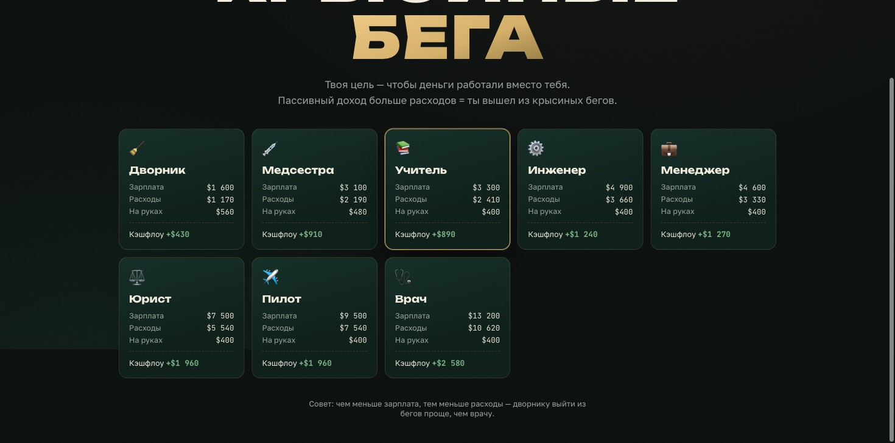
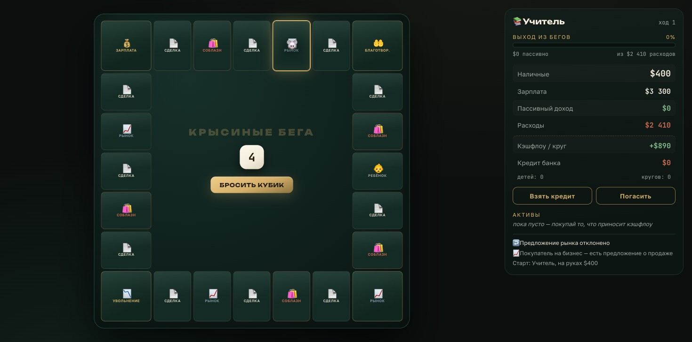
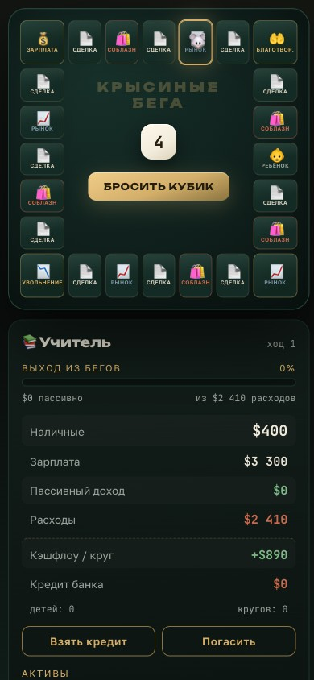

# 🐭 Крысиные бега — финансовый тренажёр

Браузерная игра по механике **Cashflow 101** (Роберт Кийосаки): выбираешь профессию,
крутишься в крысиных бегах, покупаешь активы — и выходишь из найма, когда
**пассивный доход превышает расходы**.

Играть вместо TikTok в дороге и качать финансовое мышление.

## Запуск

Никакой сборки. Три способа:

```bash
# 1. просто открыть файл
open index.html

# 2. локальный сервер
python3 -m http.server 8642   # → http://localhost:8642

# 3. GitHub Pages (с телефона)
# https://mike-prokhorov.github.io/rat-race/
```

## Как играть

1. Выбери профессию — у дворника меньше зарплата, но выйти из бегов ПРОЩЕ, чем врачу.
2. Бросай кубик. Проход через 💰 «Зарплата» = payday: доход минус расходы.
3. На клетках «Сделка» покупай то, что приносит **кэшфлоу**: недвижимость, бизнес, дивидендные акции.
4. Соблазны жгут наличные, дети увеличивают расходы, увольнение бьёт по подушке.
5. Кредит банка — рычаг (10% с тела каждый payday): ускоряет или топит.
6. Пассивный доход > расходов → **ты вышел из крысиных бегов** 🏆.

## Под капотом

- Vanilla JS, ноль зависимостей, движок отделён от UI (`js/engine.js` гоняется в node)
- Баланс целиком в `js/data.js` — правится без кода
- Смоук-тест: `node test/smoke.js` — 1000 партий ботом, 0 крашей, каждая профессия выигрываема
- Дизайн: «ночной банкирский стол» — сукно, золото, слоновая кость

## Документация (метод Смыслокода)

- [docs/00-IDEA.md](docs/00-IDEA.md) — идея снаряда: JTBD, 10 причин провала, границы MVP
- [docs/01-ARCHITECTURE.md](docs/01-ARCHITECTURE.md) — архитектура: правила, сущности, потоки
- [docs/SMYSLOKOD-STATUS.md](docs/SMYSLOKOD-STATUS.md) — статус по 7 фазам + план мобильного приложения

## Скриншоты

| Выбор профессии | Доска | Телефон |
|---|---|---|
|  |  |  |
